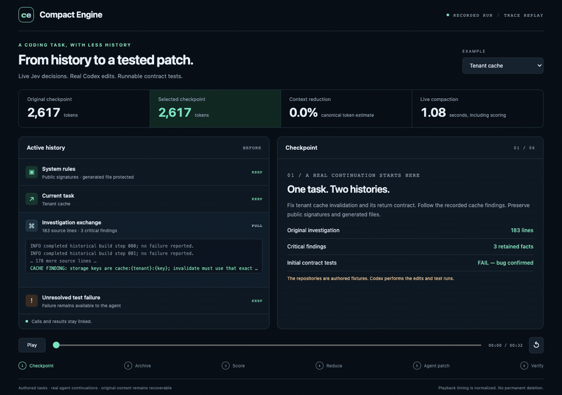

# Compact Engine

**Context compaction for coding agents, built in Go.**

Compact Engine archives the original transcript, scores smaller representations, and returns a history that preserves declared dependencies.
Use the same core through an HTTP service, a CLI, or a Go library.

**Status: experimental.** The selection threshold is not calibrated.
Live synthetic tests include successful reductions and missed targets.
A real-agent pilot passed 6/6 runs with full history and 6/6 with compacted history.
It covers three authored tasks and does not establish general success or cost savings.

[Quick start](#quick-start) · [API](docs/api.md) · [Architecture](docs/architecture.md) · [Agent pilot](#real-agent-pilot) · [Results](docs/results/README.md) · [Contributing](CONTRIBUTING.md)

## See the recorded demo



[Interactive replay](demo/index.html) · [MP4 video](demo/assets/compact-engine.mp4) · [Real-agent evidence](docs/results/agent-pilot.md)

The replay shows live scores, archived content, selected excerpts, actual code edits, and test results.
Playback timing is normalized. Original content remains recoverable.

## What it provides

- **Archive before reduction.** Recover original messages without rerunning tools.
- **Dependency-aware selection.** Keep calls, results, and explicit dependencies together.
- **Protected state.** Preserve instructions, marked failures, side effects, and recent messages.
- **Concrete alternatives.** Score excerpts, brief records, archive references, and whole-group removal.
- **Explicit failure states.** Report whether a change was applied and whether the budget was met.
- **Replaceable scoring.** Use Jev, offline replay, or your own `Scorer` implementation.

The engine does not execute agent tools or generate prose summaries.
It handles text and tool calls; it does not handle opaque reasoning blocks or multimodal content.

## Quick start

Requires Go 1.26 or later. Run these commands from a source checkout.
The offline example needs no account or API key.

```sh
go build -trimpath -o bin/compactd ./cmd/compactd

./bin/compactd compact \
  -input examples/request.json \
  -scores examples/scores.json \
  -archive .compact-data
```

The example uses recorded scores for a synthetic cache investigation.
It returns `compacted`, retains the cache finding, and preserves the unresolved test failure.
The scorer is `replay`; this command does not call Jev.

For live scoring, supply `TYPESAFE_API_KEY` through your environment and omit `-scores`:

```sh
./bin/compactd compact -input examples/request.json -archive .compact-data
```

Live scoring sends task context and candidate content to TypeSafe and incurs provider charges.
Live results can differ from recorded scores.

## HTTP service

Start an offline service:

```sh
./bin/compactd serve -scores examples/scores.json -archive .compact-data
```

Send the example from another terminal:

```sh
curl --fail-with-body http://127.0.0.1:8787/v1/compact \
  -H 'Content-Type: application/json' \
  --data-binary @examples/request.json
```

For live scoring, set `TYPESAFE_API_KEY` and start `serve` without `-scores`.
The default address is `127.0.0.1:8787`.
Set `COMPACT_API_TOKEN` to require Bearer authentication on data routes.
The CLI requires that token for a non-loopback bind.
Use TLS through a reverse proxy for remote access.
See [configuration](docs/configuration.md) for flags and limits.

## Integrate with your agent

1. Normalize the history into the [transcript schema](docs/api.md).
2. Mark unresolved work, side effects, and required dependencies.
3. Send the current goal and available input budget.
4. Check `budget_met` before using the returned history.
5. Keep `snapshot_id` for recovery.

| Result | Meaning |
|---|---|
| `unchanged` | The original already fits. |
| `compacted` | A reduction was applied and the result fits. |
| `partial` | A reduction was applied, but the result still exceeds the budget. |
| `budget_unmet` | No reduction was committed; the original remains. |
| `scoring_failed` | Scoring failed; the original remains. |

HTTP 200 and CLI exit code zero do **not** imply that the budget was met.
Partial results require `allow_partial: true`; the default is atomic behavior.
Token counts are a budgeting proxy, not exact provider billing.

### Recover an original message

```sh
./bin/compactd recall \
  -archive .compact-data \
  -snapshot SNAPSHOT_ID \
  -message old-result
```

HTTP recovery uses `GET /v1/snapshots/{id}/messages/{message}`.
Expose this route as a recall tool if your model needs archived content.
The engine does not automatically resolve archive references for the model.

### Use the Go library

Construct an engine with a scorer, counter, and archive. Then call its shared API:

```go
result, err := engine.Compact(ctx, request)
if err != nil {
    return err
}
if !result.BudgetMet {
    return errors.New("context still exceeds the input budget")
}
// Convert result.Messages to your model provider's message format.
```

See the [runnable Go example](compact/example_test.go) and [library setup](docs/configuration.md#go-library).
The public module path is `github.com/muratmirgun/compact-engine`.
Install the current development CLI with `go install github.com/muratmirgun/compact-engine/cmd/compactd@main`.

## What the tests show

### Real-agent pilot

Codex completed twelve runs across three authored tasks: tenant cache, retry policy, and cursor pagination.
Each run passed five held-out behavior tests and its file-change constraint.

| Measure | Observed result |
|---|---|
| Full history | 6/6 runs passed. |
| Compacted history | 6/6 runs passed. |
| Checkpoint reduction | 75.2–75.9%. |
| Total agent input tokens | Increased by 1.5%. |

This small pilot does not establish general coding success or cost savings. We did not measure billed cost.
Read the **[full agent pilot report](docs/results/agent-pilot.md)** for the method, individual results, actual patches, limitations, and reproduction commands.

### Implementation checks

Local verification passed all six Go packages with the race detector.
Statement coverage is **84.4% overall** and **92.8% in the core**.
Two fuzz runs completed **287,680 executions** without finding a failure.

### Live transcript experiments

An earlier live experiment used four synthetic transcript cases:

| Case | Input → output tokens | Outcome |
|---|---:|---|
| Old build log | 2,580 → 2,580 | Missed the reduction target. |
| Log with an important middle finding | 2,619 → 343 | Reduced by 86.9%; checked evidence remained. |
| Partial-budget request | 2,580 → 2,580 | Found no permitted reduction. |
| Exact rollback command | 1,037 → 1,037 | Preserved the complete command as expected. |

The successful case took about 1.04 seconds, including live scoring and local work.
These are individual observations, not latency guarantees or a coding task success rate.
The [result report](docs/results/README.md) includes failures, raw evidence, coverage, and reproduction commands.

## Development

Repository checks require Python 3.9+ and golangci-lint 2.12.2.
Python scripts use only the standard library.

```sh
make verify  # Race tests, coverage, vet, lint, build, links, and offline evaluation
make fuzz    # Excerpt and transcript invariant fuzzing
make bench   # Six local HTTP replay samples; no provider calls
```

CI defines Linux and macOS checks without API credentials.
Local reports go into the ignored `reports/` directory.
The [evaluation guide](docs/evaluation.md) documents the completed pilot and a broader paired evaluation protocol.

## Repository layout

```text
compact/          Core types, grouping, selection, and scorer interfaces
archive/          Original transcript storage and recovery
jev/              TypeSafe scoring adapter
token/            Token accounting
server/           HTTP transport
cmd/compactd/     Service and CLI entry point
examples/         Offline quick start
eval/             Transcript fixtures and real-agent evaluation
demo/             Interactive replay, GIF, MP4, and rendering script
docs/             API, architecture, evaluation, and recorded results
scripts/          Repeatable repository checks
```

## Current limits

- Loss scores and the `0.20` gate require calibration on separate tasks.
- All nonempty assistant text remains protected in this version.
- Selection is greedy and does not guarantee an optimal budget allocation.
- Archives have no encryption, retention policy, or tenant isolation.
- Provider batches run sequentially; there is no score cache or summary fallback.
- Model window accounting can differ from the engine's token estimate.
- Initial platform targets are Linux and macOS; Windows archive behavior is untested.

See [Security](SECURITY.md), [Contributing](CONTRIBUTING.md), and the [release checklist](docs/releasing.md).

## License and acknowledgments

Licensed under [Apache-2.0](LICENSE).
Third-party notices are included in [THIRD_PARTY_NOTICES.md](THIRD_PARTY_NOTICES.md).

Inspired by [fast-jev-compaction](https://github.com/tamaratran/fast-jev-compaction).
The provider adapter follows the [TypeSafe API](https://docs.typesafe.ai/introduction/quickstart).
Token accounting uses [tiktoken-go/tokenizer](https://github.com/tiktoken-go/tokenizer).
