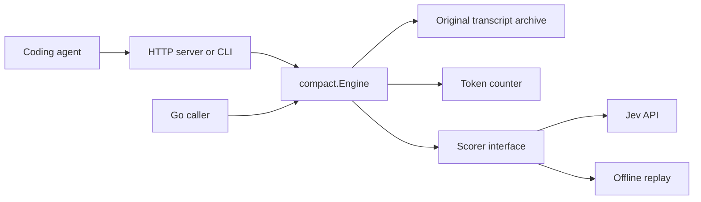

# Architecture

Compact Engine selects smaller representations of a coding agent's history.
It does not run tools, generate summaries, or call the agent's main model.

## Packages

| Path | Responsibility |
|---|---|
| `compact/` | Transcript validation, dependency groups, representations, selection, result types. |
| `archive/` | Durable snapshots, integrity checks, exact message recovery. |
| `jev/` | TypeSafe transport, bounded batches, score validation. |
| `token/` | BPE counting with explicit accounting rules. |
| `server/` | HTTP schema, authentication, admission limits, error mapping. |
| `cmd/compactd/` | Process configuration, CLI commands, graceful shutdown. |
| `eval/` | Synthetic evaluation cases and a repeatable CLI runner. |
| `scripts/` | Repository checks and local verification reports. |

The core defines `Scorer`, `Counter`, and `Store` interfaces.
Provider and storage packages depend on these interfaces through the core package.
The core does not depend on HTTP, a provider SDK, or a database.
Keep application wiring in `cmd/compactd`.

## Processing order

1. Validate the transcript before I/O.
2. Build complete dependency groups.
3. Copy the input and count its tokens.
4. Archive the original request before any provider call.
5. Return immediately if the history fits the budget.
6. Build exact replacement proposals for eligible groups.
7. Ask the scorer to assess each proposal.
8. Reject missing or invalid scores.
9. Select reductions and check the final token count.
10. Return explicit budget and application status.

If protected content already exceeds the budget, atomic mode returns the original without scoring.
Partial mode can still reduce eligible groups in that case.

## Dependency and protection rules

Tool calls and their results belong to one group.
Explicit `group` and `depends_on` links join groups transitively.
Selection preserves the original message order, including interleaved groups.
It cannot remove one half of a call/result pair.

The following content stays verbatim:

- System, developer, and user messages.
- Nonempty assistant text.
- Messages marked `pinned` or `unresolved`.
- Calls marked `side_effect` and calls awaiting results.
- The last four messages by default, plus their group members.

Set `recent_messages` to zero only when the caller supplies another recency policy.
The caller must mark unresolved work and side effects correctly.
The engine does not infer them reliably from tool names.

## Representation selection

| Action | Representation |
|---|---|
| `keep` | Original group. |
| `extract` | Up to 1,600 bytes of literal evidence per tool result, plus an archive reference. |
| `brief` | Up to 320 bytes of literal evidence, output size, and an archive reference. |
| `reference` | Tool identities and arguments, with archive references instead of result text. |
| `drop` | Entire group removed from active history; original remains in the archive. |

Excerpts prioritize matching task terms, error lines, and boundary lines.
They include omission markers and preserve UTF-8 boundaries.
They do not infer exit status or invent a summary.

The scorer sees the exact proposals and at most 16,000 bytes of original group content.
Larger sources have `complete: false`.
Global conversation context is also sampled.
Provider payload limits can reject an oversized candidate; the engine then retains the original history.

Each action receives an estimated loss score.
Only scores below `0.20` permit a reduction.
The selector compares marginal loss against marginal token savings after each choice.
This greedy method does not guarantee the optimal combination.
The threshold is uncalibrated, and scores are not measured error probabilities.

Legacy scorers can supply `relevance` and `detail` instead of `loss`.
When `loss` is present, it must cover every proposed action.
Replay copies score maps and never calls a model.

## Storage and recovery

Snapshots contain the canonical JSON request, identified by SHA-256.
Writes use a temporary file, file synchronization, rename, and directory synchronization.
Reads verify the content hash before decoding.
New archive files use `0600`; newly created archive directories use `0700`.
Existing directory permissions are not changed.

Recovery returns an original message without rerunning its tool.
The agent must expose a recall tool to its model if automatic recovery is required.
Archive storage is unencrypted and has no retention policy or tenant separation.
See [Security](../SECURITY.md).

## Extension points

A custom scorer must return all requested group and action scores.
A custom counter must be additive across messages.
A custom store must persist the original before reporting success.
Dependencies must support concurrent use when one engine serves concurrent requests.

Provider-specific encrypted state, images, and audio need separate adapters.
Do not discard unsupported fields during normalization.
